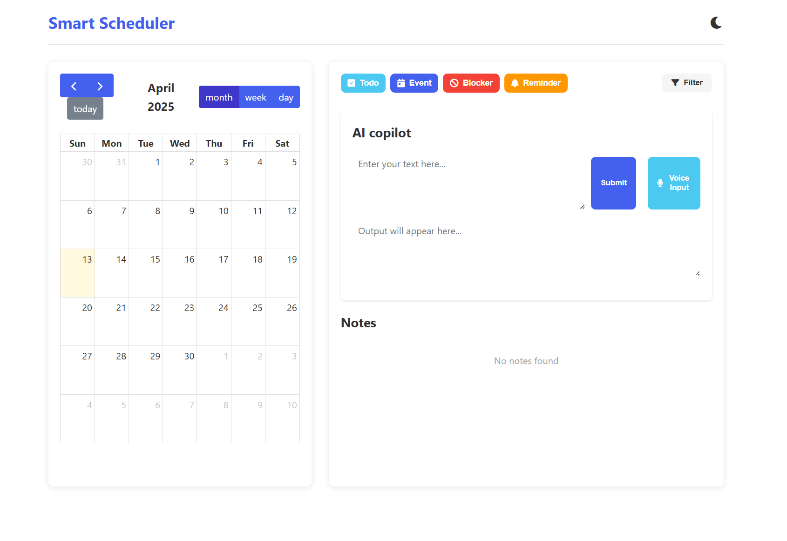

# ✨ SmartScheduler

SmartScheduler is a modern **note-taking** and **scheduling** application that integrates features like calendar visualization 🗓️, voice input 🎙️, and API endpoints 🔗. It leverages **Large Language Models (LLMs)** and agent-based architecture 🤖 to provide intelligent, responsive features to users.

---

## 📌 Introduction

SmartScheduler is a versatile tool for **note-taking** and **time management**. It features a clean and responsive UI 🌈 with light/dark theme support 🌗. The app uses **FullCalendar** for visualization and offers a robust API for integration. Powered by LLMs, it can understand user queries in natural language 💬 and assist with planning.
<br>



---

## 🚀 Key Features

- 🎨 **Modern UI Design** – Clean, responsive interface with dark/light themes.
- 📅 **Calendar Integration** – Visualize notes, events, and todos with FullCalendar.
- 📝 **Multiple Note Types** – Create todos, events, blockers, and reminders.
- ⏰ **Time Management** – Time-bound blockers and reminders with notifications.
- 🌐 **API Endpoints** – Structured RESTful APIs for integration with other apps.
- 🤖 **LLM + Agent Support** – Intelligent task handling and response generation.

---

## 📁 Project Folder Structure

```
SmartScheduler/
│
├── mcp_backend/ (python backend code for agentic decision making)
│   ├── agent.py
│   ├── decision.py
│   ├── model.py
│   ├── memory.py
│   ├── system_prompt_template.py
|
├── web_app/ (frontend code for the web app)
│   ├── server.js
│   ├── index.html
│   ├── package.json
│   ├── package-lock.json
│   ├── css/
│   ├── data/
│   ├── api-docs.html  
│   ├── node_modules
│   ├── js/
|
├── token.env (environment variables for the project)
├── .gitignore (git ignore file)
├── env/ (python environment)
├── requirements.txt (python dependencies)
├── screenshot.png (screenshot of the web app)
├── README.md (this file)
```

---

## 🛠️ Tools Available for LLM

Defined in `mcp_server.py`:

- 🕐 **get_current_time** – Returns current time (HH:MM)
- 📆 **get_current_date** – Returns current date (YYYY-MM-DD)
- ✅ **list_todos** – Lists todos for a given date
- ➕ **create_todo** – Creates a new todo
- ✔️ **complete_todo** – Marks a todo as completed
- 🔄 **uncomplete_todo** – Marks a todo as uncompleted
- ❌ **delete_todo** – Deletes a todo by ID
- 📋 **list_events** – Lists events for a date
- 🗓️ **create_event** – Creates an event
- 🗑️ **delete_event** – Deletes an event
- ⏳ **list_reminders** – Lists reminders
- 🔔 **create_reminder** – Creates a reminder
- 🧹 **delete_reminder** – Deletes a reminder
- 👋 **get_greeting** – Returns a personalized greeting
- 🧪 **review_code** – Reviews code snippets
- 🐛 **debug_error** – Assists with debugging errors

---

## 🧪 Steps to Run the Application

### ✅ Prerequisites

- 🧩 **Node.js**
- 🐍 **Python 3.11**
- 🐧 **Ubuntu** (Tested on Ubuntu 22.04 LTS and above)

---

### 📥 Installation

1. **Clone the Repository**:
   ```bash
   git clone https://github.com/devdastl/Smart_Scheduler_AI-EAG_S-5.git
   cd SmartScheduler
   ```

2. **Install Node.js Dependencies**:
   ```bash
   cd web_app && npm install && cd ..
   ```

3. **Set Up Python Environment**:
   ```bash
   python3.11 -m venv env
   ```
   - **Activate the environment**:
       ```bash
       source env/bin/activate
       ```
   - **Install the required packages**:
     ```bash
     pip install -r requirements.txt
     ```

4. **Run the Application**:
   - Start Node.js server:
     ```bash
     cd web_app && npm start
     ```

5. **Access the App**:
   - 🌐 Visit `http://localhost:3000` in your browser.

---

## 🔮 Future Enhancements


1. 🔗 **Unified Integration** – Tighter integration between calendar, notes, and LLM responses for a more seamless experience.
2. 🕒 **Time-aware Task Creation** – Enhanced natural language support for time-specific creation of todos and events (e.g., “remind me to call John at 3 PM”).
3. 🧵 **Linked Entities** – Ability to **link todos, events, reminders, and blockers** together so related items can reference each other contextually.
4. 🧠 **Context-Aware Suggestions** – LLM-driven recommendations based on historical activity and context (e.g., suggest break blocks or reschedule conflicting items).
---

### 📚 Additional Info

- 📑 **API Docs**: [http://localhost:3000/api-docs](http://localhost:3000/api-docs)
- 🪪 **License**: MIT
